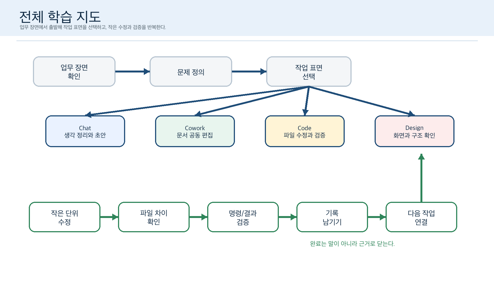
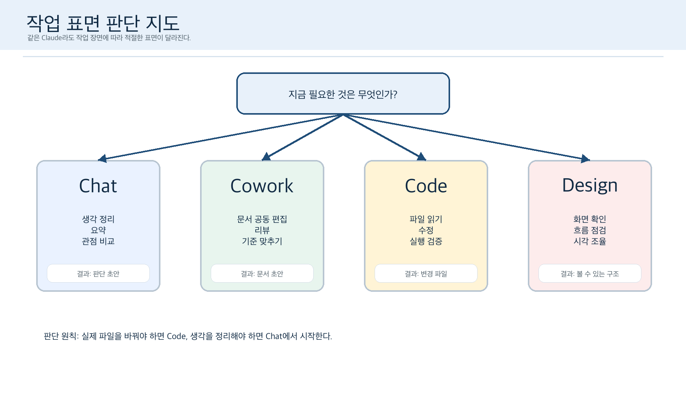
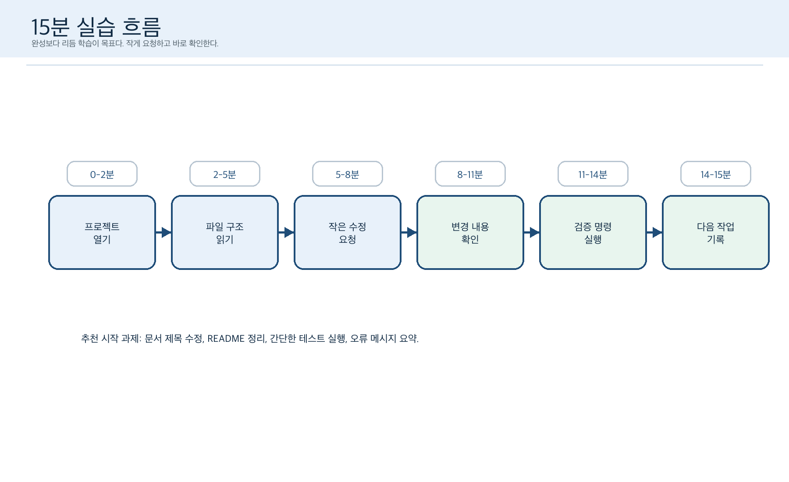
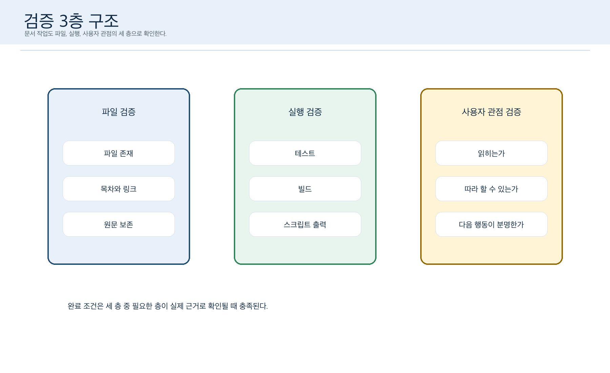
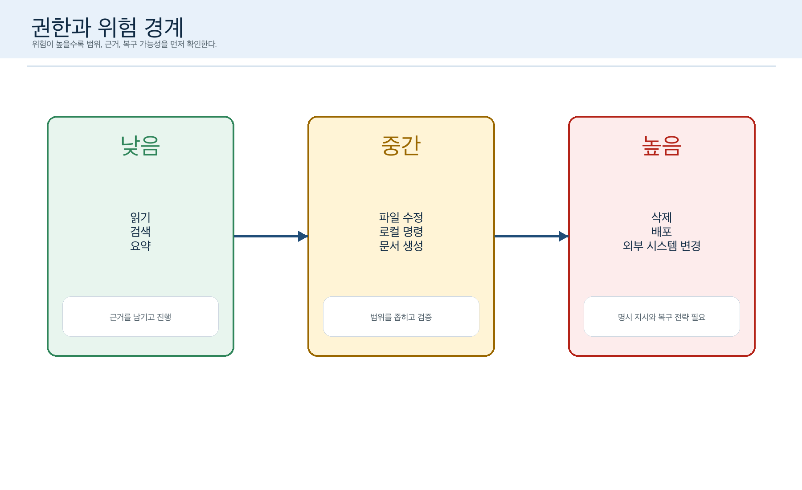
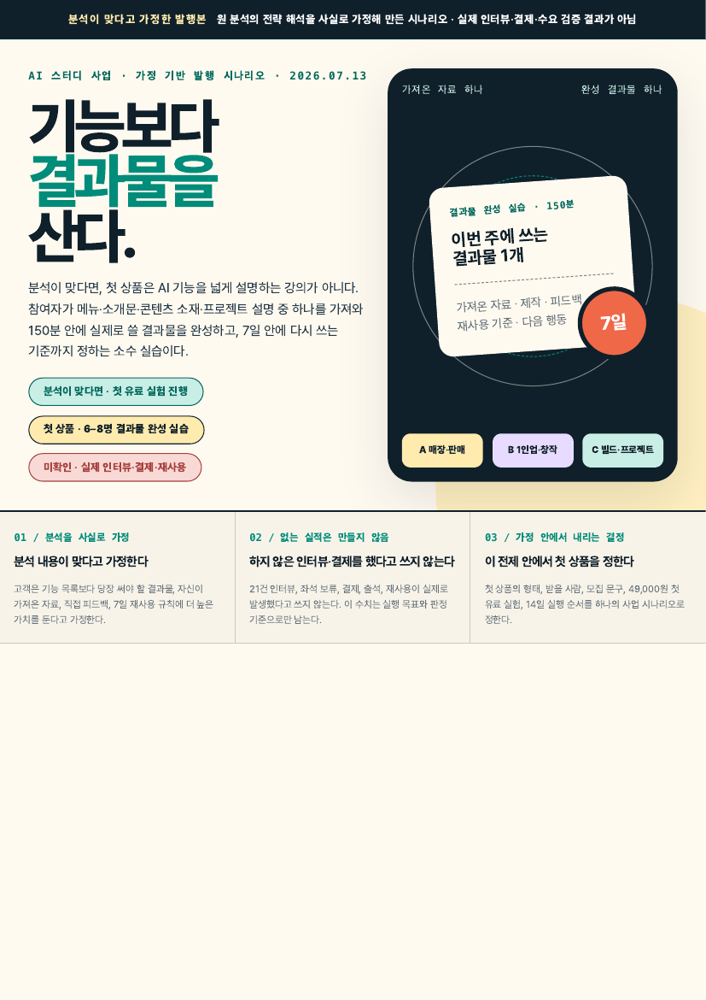
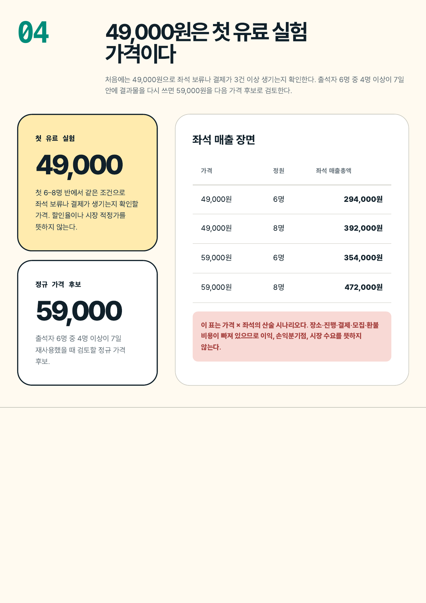

  

<h1 align="center">Visual Authoring</h1>

  <strong>복잡한 자료를, 사람이 이해하고 검토하고 결정할 수 있는 시각 결과물로 만듭니다.</strong> 
  <em>Turn raw material into visual work people can understand, review, and act on.</em>

## 프로젝트 소개

Visual Authoring은 문서, 슬라이드, 랜딩 페이지, 앱 UI, 교재처럼 설명과 판단이 함께 필요한 결과물을 위한 저작 스킬입니다. 보기 좋은 화면을 빠르게 만드는 데서 멈추지 않고, **무엇을 왜 보여줄지**를 먼저 정한 뒤 독자가 이해할 수 있는 구조와 장면으로 만듭니다.

심볼은 이 흐름을 압축해서 보여줍니다. 흩어진 조각은 원본 자료를, 정돈되는 형태는 저작 과정을, 바깥의 궤적은 검토와 수정의 반복을 뜻합니다. 마지막에 프레임에 닿는 손끝은 AI가 아니라 사람이 공개·수정·릴리즈를 결정한다는 경계를 남깁니다.

~~~mermaid
flowchart LR
  A["원본 자료"] --> B["독자와 결정"]
  B --> C["시각 전략"]
  C --> D["문서 · 슬라이드 · 화면"]
  D --> E["검토와 수정"]
  E --> F["사람의 승인"]
~~~

## 무엇을 돕나

| 상황 | Visual Authoring이 하는 일 |
|---|---|
| 발표 자료 | 핵심 주장, 순서, 장면별 메시지를 정리하고 읽히는 슬라이드 구조를 만든다. |
| 문서·교재 | 정보량을 줄이지 않고도 독자가 흐름을 따라갈 수 있게 의미와 시각 계층을 설계한다. |
| 랜딩 페이지·앱 UI | 사용자가 이해해야 할 상태·행동·결정 지점을 화면 구조로 구체화한다. |
| 기존 자료 개선 | 원본을 그대로 꾸미기보다, 유지할 것·새로 만들 것·검증할 것을 구분해 새 후보를 만든다. |

## 처음이라면: 10분 시작 가이드

Visual Authoring은 별도 디자인 앱이 아닙니다. 이 스킬을 사용할 수 있는 AI 에이전트에게 자료와 목적을 알려 주고, 결과를 함께 검토하는 작업 가이드입니다. 디자인 도구를 다룰 줄 몰라도 시작할 수 있습니다. 지금 가진 초안·메모·표·링크·기존 자료 중 하나와, **누가 무엇을 이해하거나 결정해야 하는지**만 있으면 됩니다.

### 1. 먼저 이 네 가지만 적으세요

| 적을 것 | 생각해 볼 질문 | 예시 |
|---|---|---|
| 원본 | 지금 가진 자료는 무엇인가? | 회의 메모, 20장 슬라이드, 가격표, 문서 링크 |
| 독자 | 이 결과물을 처음 보는 사람은 누구인가? | 처음 참여하는 팀원, 고객, 수강생 |
| 바라는 변화 | 독자가 무엇을 이해·비교·선택·실행해야 하는가? | 세 선택지의 차이를 알고 하나를 고르기 |
| 결과물 | 어디에서 읽거나 보여 줄 것인가? | 8장 발표 자료, 4쪽 문서, 랜딩 페이지 |

원본이 거칠어도 괜찮습니다. 파일을 붙일 수 없다면 제목, 목차, 핵심 문장, 꼭 틀리면 안 되는 숫자만 적어도 됩니다. 기존 결과물을 고칠 때는 **이어서 개선할지**, 아니면 **새로 시작할지**도 함께 알려 주세요.

### 2. 아래 요청문을 복사해 시작하세요

~~~text
Visual Authoring을 사용해 이 자료를 시각 결과물로 만들어 주세요.

원본: [파일, 링크, 또는 붙여 넣은 메모]
독자: [예: 처음 참여하는 팀원]
독자가 해야 할 일: [예: 세 선택지의 차이를 이해하고 하나를 고르기]
결과물: [예: 8장 발표 자료 / 4쪽 문서 / 랜딩 페이지]
기존 결과물: [있으면 이어서 개선 / 없으면 새로 시작]
조건: [예: 로고 사용, 10분 발표, 모바일에서도 읽기]

먼저 원본에서 유지할 것, 보완할 것, 확인이 필요한 것을 정리해 주세요.
선택에 따라 결과가 달라진다면 서로 다른 시각 전략과 대표 화면을 보여 주세요.
내가 방향을 고른 뒤에 본문을 만들어 주세요.
숫자·인용·사실을 추정하지 말고, 모르는 내용은 '확인 필요'로 남겨 주세요.
~~~

### 3. 작업은 이런 순서로 진행됩니다

1. **자료와 목표를 확인합니다.** 유지할 내용, 새로 채울 내용, 아직 알 수 없는 내용을 나눕니다.
2. **읽는 사람의 과업에 맞춰 구조를 고릅니다.** 비교는 대비로, 순서는 흐름으로, 선택은 분기로, 근거는 표·주석으로 보여 줄 수 있습니다.
3. **필요할 때 방향을 비교합니다.** 형식이나 표현 방식이 결과를 크게 바꾸면, 대표 화면을 보고 어느 쪽을 만들지 고릅니다.
4. **결과물을 만들고 함께 검토합니다.** 읽기 순서, 사실 관계, 실제 사용 화면에서의 가독성을 확인합니다.
5. **공개와 최종 승인은 사람이 결정합니다.** 화면이 만들어졌다는 사실은 사람의 이해, 실제 편집 가능성, 배포 완료를 자동으로 뜻하지 않습니다.

### 4. 결과를 받으면 이것만 확인하세요

- 첫 화면을 3초 봤을 때 **누구를 위한 무엇인지** 알 수 있는가?
- 장식이 아니라 비교·순서·관계·위험 중 필요한 내용을 더 쉽게 읽게 하는가?
- 핵심 숫자·인용·주장이 원본과 맞고, 가정과 확인한 사실이 섞이지 않았는가?
- 발표·인쇄·모바일처럼 실제로 쓸 화면에서 글자와 대비가 읽히는가?
- 다음 수정에서 내가 고를 일과, 사람이 최종 판단해야 할 일이 구분되는가?

### 자주 막히는 요청을 바꾸는 법

| 이렇게만 말하면 | 이렇게 바꿔 보세요 |
|---|---|
| “예쁘게 만들어 줘.” | “처음 보는 고객이 가격 차이를 이해하고 상담을 신청할 수 있는 1쪽으로 만들어 줘.” |
| “PPT 만들어 줘.” | “12분 발표용 8장으로, 팀이 다음 주 우선순위를 고르게 만들어 줘.” |
| 브랜드 색만 전달 | 독자, 원하는 결정, 결과물 형태, 분량을 함께 적기 |
| 원본 없이 수치를 확정 | 빈칸은 `확인 필요`로 두고, 무엇을 검증해야 하는지 먼저 요청하기 |
| 보이는 화면만 보고 끝내기 | 실제 기기·편집 도구·독자 검토에서 확인할 항목을 나눠 점검하기 |

## 실제 결과 사례

아래는 이 방식으로 완성한 결과물 가운데, 서로 다른 시각 문법이 또렷하게 남은 장면을 골랐습니다. 목적은 “보기 좋은 예시”를 모으는 데 있지 않습니다. 같은 내용을 지도·분기·시간·층위·경계·보고서 지면으로 각각 읽게 만드는 방식을 보여 줍니다. 독자의 실제 이해도나 업무 성과는 별도 사용자 검증 없이는 주장하지 않습니다.

### 1. 한 가이드를 지도, 선택, 시간, 검증, 경계로 나눈 교육 시각물

AI 협업 도구 학습 가이드에서 한 장의 만능 도식으로 끝내지 않고, 독자가 매 단계에서 다른 질문을 하도록 다섯 장면을 나눴습니다. 전체 관계는 지도에, 작업 표면 선택은 분기 구조에, 첫 실습은 시간 흐름에, 완료 조건은 검증 층에, 위험한 행동은 권한 경계에 담았습니다.

  
  

  
  
  

### 2. 가정과 검증 경계를 숨기지 않는 의사결정 보고서

사업 시나리오 보고서에서는 표지부터 “가정한 분석”임을 먼저 밝히고, 가격·정원·매출총액을 한 페이지에 모았습니다. 큰 수치가 결론처럼 보이지 않도록, 산술값과 아직 확인하지 않은 시장 수요를 같은 장면에서 분리했습니다.

  
  

### 3. 실제 제품 화면을 학습 장면으로 다시 엮은 분석 가이드

PostHog 콘텐츠 행동 분석 가이드는 Heatmap, Replay, Funnel의 실제 화면을 그대로 늘어놓지 않았습니다. 화면 하나마다 먼저 확인할 질문, 다음에 볼 분해 기준, 관찰과 원인을 섞지 않는 중단 규칙을 붙여 12쪽의 학습 순서로 재구성했습니다. 이 사례의 제품 화면은 원권리자 자료이므로 저장소에는 복제하지 않고, 아래 자산 기록에 권리 경계와 제외 이유를 남겼습니다.

선정 기준과 자산별 권리·주장 경계는 [`assets/examples/README.md`](assets/examples/README.md)에서 확인할 수 있습니다.

## 작업 원칙

- **내용 적합성을 장식보다 먼저 봅니다.** 시각 효과는 메시지와 독자의 판단을 돕는 경우에만 씁니다.
- **시스템은 고정하고 장면은 열어 둡니다.** 공통 구조와 품질 기준은 유지하되, 모든 결과물을 같은 레이아웃으로 만들지 않습니다.
- **검토 가능하게 만듭니다.** 구조, 읽기, 렌더, native runtime, 사람의 판단을 하나의 “통과”로 섞지 않습니다.
- **최종 권한은 사람에게 둡니다.** AI는 후보와 검토 자료를 만들 수 있지만, 승인과 공개를 대신하지 않습니다.

## 저장소 둘러보기

| 경로 | 내용 |
|---|---|
| [`SKILL.md`](SKILL.md) | 전체 저작 흐름과 실행 계약 |
| [`references/`](references/) | 시각 전략, 리뷰, 문서·슬라이드 구현 기준 |
| [`scripts/`](scripts/) | 구조와 구현 검증 도구 |
| [`fixtures/`](fixtures/) · [`evals/`](evals/) | 검증용 입력과 평가 자료 |
| [`assets/`](assets/) | 프로젝트 심볼, 실제 결과 사례, 자산 메타데이터 |

## 범위와 라이선스

이 프로젝트는 결과물이 사람에게 실제로 이해되었는지, 원본 편집 도구에서 열리는지, 배포가 완료되었는지를 출력 화면만으로 단정하지 않습니다. 필요한 증거와 사람의 승인은 작업 맥락에서 별도로 확인합니다.

별도 표기가 없는 이 저장소의 원저작물은 [CC BY-NC 4.0](LICENSE)을 따릅니다. 심볼과 사례 자산의 생성·권리 경계는 [`assets/visual-authoring-symbol.provenance.md`](assets/visual-authoring-symbol.provenance.md)와 [`assets/examples/README.md`](assets/examples/README.md)에 기록했습니다.
