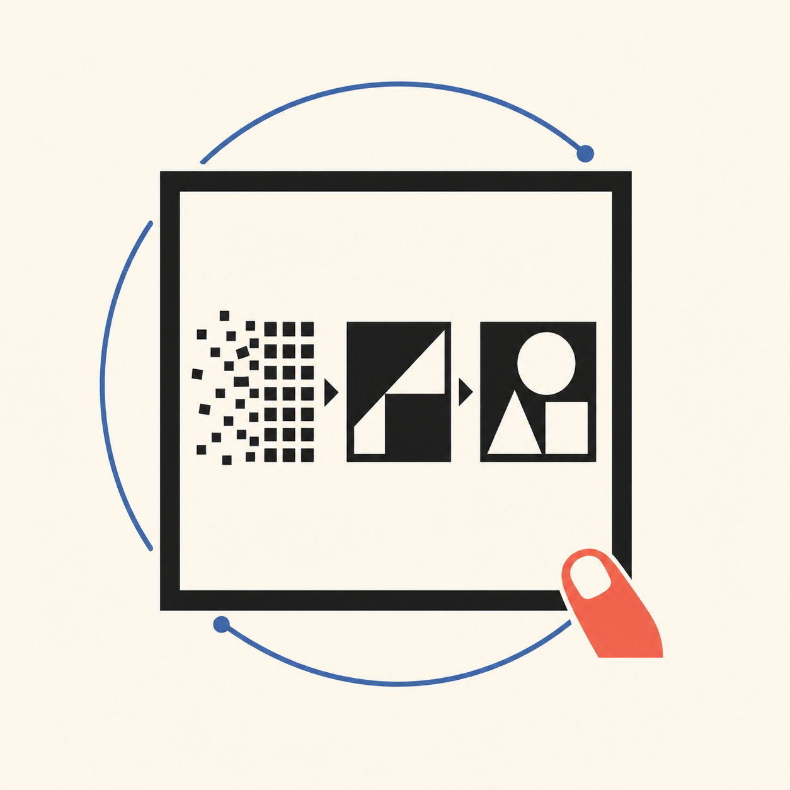

  

<h1 align="center">Visual Authoring</h1>

  <strong>복잡한 자료를, 사람이 이해하고 검토하고 결정할 수 있는 시각 결과물로 만듭니다.</strong> 
  <em>Turn raw material into visual work people can understand, review, and act on.</em>

## 프로젝트 소개

Visual Authoring은 문서, 슬라이드, 랜딩 페이지, 앱 UI, 교재처럼 설명과 판단이 함께 필요한 결과물을 위한 저작 스킬입니다. 보기 좋은 화면을 빠르게 만드는 데서 멈추지 않고, **무엇을 왜 보여줄지**를 먼저 정한 뒤 독자가 이해할 수 있는 구조와 장면으로 만듭니다.

심볼은 이 흐름을 압축해서 보여줍니다. 흩어진 조각은 원본 자료를, 정돈되는 형태는 저작 과정을, 바깥의 궤적은 검토와 수정의 반복을 뜻합니다. 마지막에 프레임에 닿는 손끝은 AI가 아니라 사람이 공개·수정·릴리즈를 결정한다는 경계를 남깁니다.

~~~mermaid
flowchart LR
  A["원본 자료"] --> B["독자와 결정"]
  B --> C["시각 전략"]
  C --> D["문서 · 슬라이드 · 화면"]
  D --> E["검토와 수정"]
  E --> F["사람의 승인"]
~~~

## 무엇을 돕나

| 상황 | Visual Authoring이 하는 일 |
|---|---|
| 발표 자료 | 핵심 주장, 순서, 장면별 메시지를 정리하고 읽히는 슬라이드 구조를 만든다. |
| 문서·교재 | 정보량을 줄이지 않고도 독자가 흐름을 따라갈 수 있게 의미와 시각 계층을 설계한다. |
| 랜딩 페이지·앱 UI | 사용자가 이해해야 할 상태·행동·결정 지점을 화면 구조로 구체화한다. |
| 기존 자료 개선 | 원본을 그대로 꾸미기보다, 유지할 것·새로 만들 것·검증할 것을 구분해 새 후보를 만든다. |

## 이렇게 사용합니다

1. **원본을 준비합니다.** 브리프, 초안, 데이터, 기존 슬라이드, 메모처럼 지금 가진 자료면 충분합니다.
2. **독자와 원하는 결정을 적습니다.** 누가 무엇을 이해하고, 어떤 선택이나 행동을 해야 하는지 밝힙니다.
3. **매체와 제약을 정합니다.** 슬라이드인지, 읽는 문서인지, 앱 화면인지와 분량·브랜드·편집 가능성 조건을 알려줍니다.
4. **시각 경로를 비교합니다.** 하나의 기본 스타일을 밀어붙이지 않고, 콘텐츠에 맞는 장면·표현·구조 후보를 비교합니다.
5. **사람이 검토하고 승인합니다.** 렌더가 보인다는 사실과 실제로 이해·편집·배포할 수 있다는 사실을 구분합니다.

호환되는 에이전트 환경에서는 아래처럼 요청을 시작할 수 있습니다.

~~~text
Use the visual-authoring skill.

Source: [원본 자료 또는 링크]
Audience: [누가 읽는가]
Decision or action: [독자가 이해·선택·실행해야 할 것]
Surface: [슬라이드 / 문서 / 랜딩 페이지 / 앱 UI]
Constraints: [분량, 브랜드, 편집 가능성, 접근성 등]

Show the proposed visual strategy before building.
~~~

## 작업 원칙

- **내용 적합성을 장식보다 먼저 봅니다.** 시각 효과는 메시지와 독자의 판단을 돕는 경우에만 씁니다.
- **시스템은 고정하고 장면은 열어 둡니다.** 공통 구조와 품질 기준은 유지하되, 모든 결과물을 같은 레이아웃으로 만들지 않습니다.
- **검토 가능하게 만듭니다.** 구조, 읽기, 렌더, native runtime, 사람의 판단을 하나의 “통과”로 섞지 않습니다.
- **최종 권한은 사람에게 둡니다.** AI는 후보와 검토 자료를 만들 수 있지만, 승인과 공개를 대신하지 않습니다.

## 저장소 둘러보기

| 경로 | 내용 |
|---|---|
| [`SKILL.md`](SKILL.md) | 전체 저작 흐름과 실행 계약 |
| [`references/`](references/) | 시각 전략, 리뷰, 문서·슬라이드 구현 기준 |
| [`scripts/`](scripts/) | 구조와 구현 검증 도구 |
| [`fixtures/`](fixtures/) · [`evals/`](evals/) | 검증용 입력과 평가 자료 |
| [`assets/`](assets/) | 프로젝트 심볼과 자산 메타데이터 |

## 범위와 라이선스

이 프로젝트는 결과물이 사람에게 실제로 이해되었는지, 원본 편집 도구에서 열리는지, 배포가 완료되었는지를 출력 화면만으로 단정하지 않습니다. 필요한 증거와 사람의 승인은 작업 맥락에서 별도로 확인합니다.

별도 표기가 없는 이 저장소의 원저작물은 [CC BY-NC 4.0](LICENSE)을 따릅니다. 심볼의 생성·권리 경계는 [`assets/visual-authoring-symbol.provenance.md`](assets/visual-authoring-symbol.provenance.md)에 기록했습니다.
