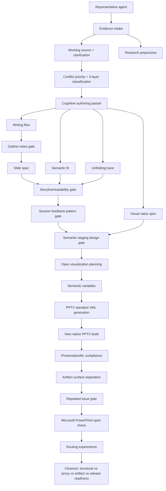

# Concept Map

Path: `/Volumes/Extend/.codex-relocated/skills/document-slide-authoring-agent-system`

Scope: local-only concept map for the document slide authoring agent system. It
defines the workflow boundary from evidence intake through cognitive authoring,
story/visual planning, standard XML-aware PPTX generation, and PowerPoint release
evidence.

## Ownership Map

| Surface | Owner | Evidence |
| --- | --- | --- |
| Goal, rubric, routing | representative-agent | `authoring-agent-system-audit.json` |
| Source inventory, research, and working source | evidence-intake-agent | research audit, corpus, particles, handoff, clarification packet |
| Reader task, semantic fit, unfolding, and visual values | cognitive-authoring-agent | `cognitive-authoring-packet.json` |
| Brief, seed, outline, outline notes, slide specs | writing-agent | `outline-notes.md`, manual/prompt/pipeline audits |
| Outline notes gate | writing-agent, storyline-readability-agent, pptx-build-agent | outline note review, `outline-notes.md` |
| Title-only story and cognitive readability proxy | storyline-readability-agent | storyline-readability-audit.json |
| Repeated review feedback patterns | session-feedback-agent | session-feedback-pattern-audit.json |
| Semantic staging design brief | visualization-agent | staging-design-brief.json |
| Open visualization plan and semantic variables | visualization-agent | semantic variable file, slide specs |
| Standard XML-aware PPTX generation | pptx-build-agent | PPTX file, helper/build log, native feature audit |
| Native PPTX package | pptx-build-agent | PPTX file, native feature audit |
| ECMA-376 / OPC / DrawingML coverage | presentationml-compliance-agent | PresentationML spec audit |
| Artifact surface roles | artifact-surface-agent | artifact-surface-map.json |
| Repeated PowerPoint recovery blocker | repetition-gate-agent | repetition gate audit |
| Fresh PowerPoint open evidence | powerpoint-open-check-agent | manual open check record |

## Readiness Boundary

Structural readiness can pass while release readiness is blocked. That is an intended state, not a failure, when manual PowerPoint evidence is missing or a recovered PPTX artifact exists.

Storyline/readability proxy readiness is separate from human learning outcome validation. A deck may pass title-only story, assertion-evidence, one-beat, scan, and cognitive-load checks without proving learner comprehension, retention, transfer, or performance.

Cognitive authoring packet readiness is separate from both final writing quality
and release readiness. It proves that the workflow has declared reader situation,
cognitive task, semantic fit, unfolding trace, and visual value intent before
production. It does not prove that a human audience understood, retained, or used
the artifact.

Outline-note readiness is separate from both slide-spec completeness and speaker
notes. It proves that the deck or document has an inspectable flow connecting
reader situation, purpose, section flow, title story, visible message, spoken
notes, evidence links, visual intent, and open questions before PPTX production.

Semantic-staging readiness is separate from predefined-style consistency and from
human outcome validation. It proves that a scene beat, attention entry,
curiosity gap, reading path, listening cue, evidence reveal, semantic variables,
accessibility/load, design-freedom boundary, open expression options,
selected-expression rationale, and avoid-unnecessary-constraints decisions are
explicit before open visualization planning or PPTX build.

Artifact surface readiness is separate from release readiness. A deck may be
native-valid while the evidence table, instructor handoff, or delivery package is
still incomplete. Conversely, a source/evidence bundle may be complete while the
manual PowerPoint open gate remains blocked.
