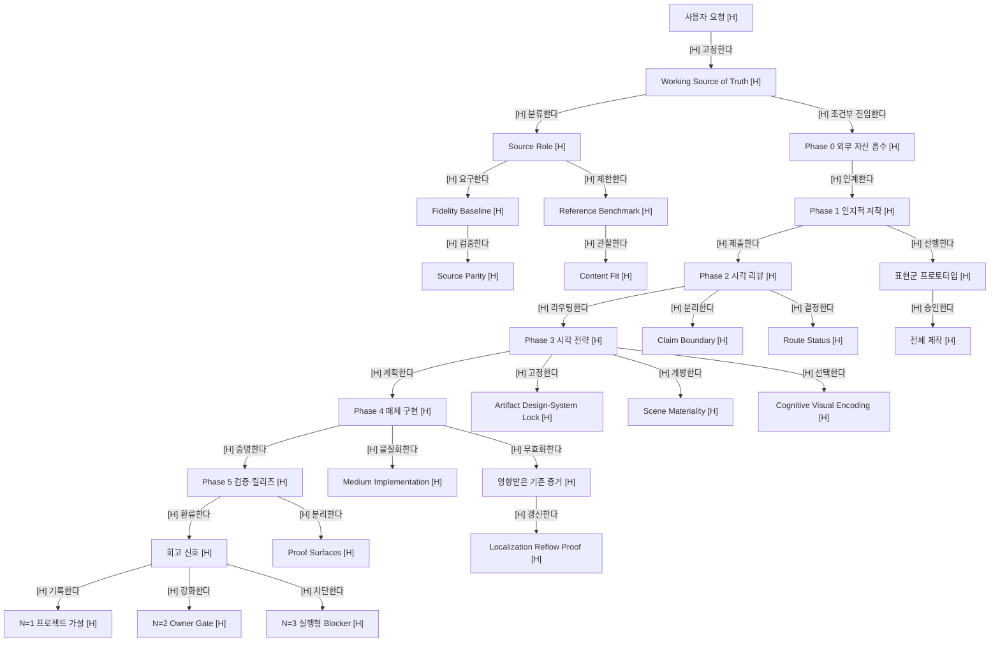
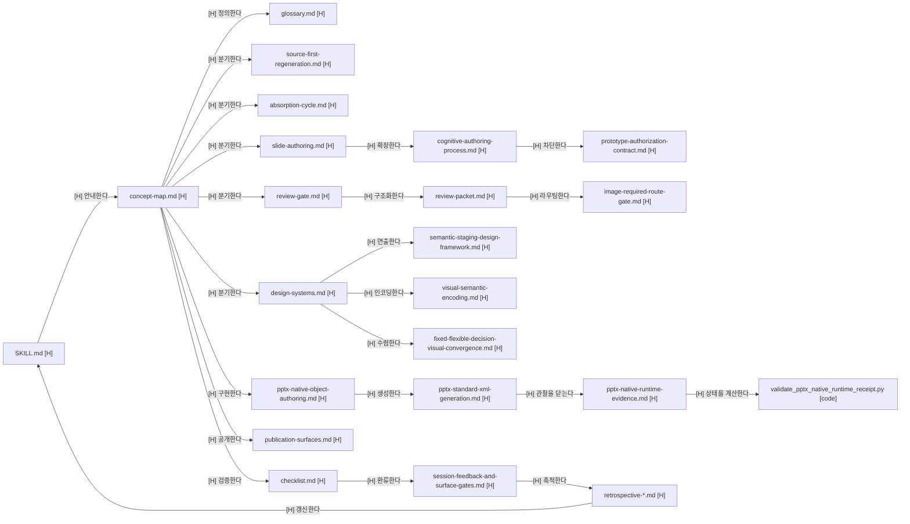

# Concept Map — visual-authoring 정보·문서 연결망

이 문서는 `visual-authoring`의 **정보 관계**, **Markdown 문서 관계**, **검증 경로**를 한곳에서 탐색하는 정본 인덱스다. Phase 순서만 보여 주는 흐름도가 아니라, 어떤 판단이 어느 문서에서 시작되고 어디로 인계되며 무엇으로 검증되는지를 연결한다.

## Map Contract

- **map type**: `hybrid` — 절차 흐름과 문서 토폴로지를 함께 표현한다.
- **audience**: 스킬 사용자, 유지보수자, reviewer, validator 작성자.
- **source boundary**: [`../SKILL.md`](../SKILL.md), 이 디렉터리의 active references, [`../scripts/`](../scripts/)만 현재 계약 근거로 사용한다. [`../_absorbed/`](../_absorbed/)는 provenance이지 active runtime 계약이 아니다.
- **interpretation boundary**: 파일과 계약의 연결은 설명할 수 있지만, 특정 산출물의 콘텐츠 적합성·미적 품질·사람 이해를 이 맵만으로 확정하지 않는다.
- **evidence strength**: `[H]`는 active 문서에 직접 명시, `[M]`은 여러 문서에서 합리적으로 도출, `[L]`은 후속 검토가 필요한 가설이다.
- **artifact decision**: 이번 정본은 Markdown 탐색이 목적이므로 별도 JSON/HTML/live `<펼침>`은 만들지 않는다. 상호작용 맵이 필요해질 때 이 문서를 source inventory로 사용한다.

## 1. 정보 관계 맵



## 2. 핵심 관계 레지스터

| source node | verb link | target node | layer | strength | 문서 근거 |
|---|---|---|---|---|---|
| Working Source of Truth | 고정한다 | 목표·범위·성공 조건 | core | high | [`../SKILL.md`](../SKILL.md), [`glossary.md`](glossary.md) |
| Source Role | 분기한다 | Fidelity Baseline | ops | high | [`source-first-regeneration.md`](source-first-regeneration.md) |
| Source Role | 분기한다 | Reference Benchmark | ops | high | [`source-first-regeneration.md`](source-first-regeneration.md) |
| Fidelity Baseline | 요구한다 | Source Parity | evidence | high | [`source-first-regeneration.md`](source-first-regeneration.md) |
| Reference Benchmark | 제한한다 | 1:1 유사도 주장 | risk | high | [`source-first-regeneration.md`](source-first-regeneration.md), [`fixed-flexible-decision-visual-convergence.md`](fixed-flexible-decision-visual-convergence.md) |
| 인지적 저작 | 선행한다 | 표현군 프로토타입 | ops | high | [`cognitive-authoring-process.md`](cognitive-authoring-process.md), [`prototype-authorization-contract.md`](prototype-authorization-contract.md) |
| 표현군 프로토타입 | 승인한다 | 전체 제작 | ops | high | [`prototype-authorization-contract.md`](prototype-authorization-contract.md) |
| 시각 리뷰 | 분리한다 | proxy·risk·human outcome | core | high | [`review-gate.md`](review-gate.md), [`review-packet.md`](review-packet.md) |
| Route Status | 선택한다 | SVG·image·hybrid | ops | high | [`image-required-route-gate.md`](image-required-route-gate.md) |
| Content Visual Strategy | 선행한다 | Expression System | core | high | [`design-systems.md`](design-systems.md) |
| Expression System | 물질화한다 | Medium Implementation | ops | high | [`design-systems.md`](design-systems.md), [`semantic-staging-design-framework.md`](semantic-staging-design-framework.md) |
| Artifact Design-System Lock | 제한한다 | style drift | ops | high | [`design-systems.md`](design-systems.md) |
| Scene Materiality | 확장한다 | 장면별 표현 후보 | interpretation | high | [`semantic-staging-design-framework.md`](semantic-staging-design-framework.md) |
| Cognitive Visual Encoding | 연결한다 | 관계·추론·시각 문법 | core | high | [`design-systems.md`](design-systems.md), [`visual-semantic-encoding.md`](visual-semantic-encoding.md) |
| Native Object Intent | 규정한다 | PPTX 편집 가능 의미 단위 | ops | high | [`pptx-native-object-authoring.md`](pptx-native-object-authoring.md) |
| Copy Change | 무효화한다 | 영향받은 proof | evidence | high | [`semantic-staging-design-framework.md`](semantic-staging-design-framework.md), [`retrospective-fixed-system-open-materiality-localization-reflow-20260713.md`](retrospective-fixed-system-open-materiality-localization-reflow-20260713.md) |
| Rebuild | 무효화한다 | render·native·open evidence | evidence | high | [`prototype-authorization-contract.md`](prototype-authorization-contract.md), [`checklist.md`](checklist.md) |
| Fixed Audit | 제한한다 | 품질·학습성과 주장 | risk | high | [`cognitive-authoring-process.md`](cognitive-authoring-process.md), [`session-feedback-and-surface-gates.md`](session-feedback-and-surface-gates.md) |
| 회고 신호 | 승격한다 | 가설·게이트·blocker | ops | high | [`cognitive-authoring-process.md`](cognitive-authoring-process.md), 아래 회고 문서군 |

## 3. Markdown 문서 토폴로지



## 4. 문서군별 탐색 경로

### 4.1 정본·원본·저작

| Markdown | 들어오는 연결 | 다음 연결 | 맡는 정보 |
|---|---|---|---|
| [`glossary.md`](glossary.md) | `SKILL.md`, 모든 reference | 해당 개념의 owner 문서 | 공통 용어와 상태 의미 |
| [`source-first-regeneration.md`](source-first-regeneration.md) | Working SoT, 원본 artifact | `slide-authoring.md`, `pptx-native-object-authoring.md` | 원본 해체, 역할, parity, editability |
| [`absorption-cycle.md`](absorption-cycle.md) | 다중 외부 자산 4조건 | `slide-authoring.md`, `source-notes.md` | Phase 0 잠금·흡수·충돌·검증 카운트 |
| [`slide-authoring.md`](slide-authoring.md) | Source-first 또는 Phase 0 | `course-flow-to-design-system-sequence.md`, `cognitive-authoring-process.md` | Phase 1 인덱스와 native capability scan |
| [`course-flow-to-design-system-sequence.md`](course-flow-to-design-system-sequence.md) | 인지적 저작 패킷 | `design-systems.md` | course flow에서 디자인 시작점까지의 고정 순서 |
| [`slide-authoring-methods.md`](slide-authoring-methods.md) | `slide-authoring.md` | `checklist.md` | 저작 방법, 증거 계층, gate test |
| [`cognitive-authoring-process.md`](cognitive-authoring-process.md) | Phase 1 | `prototype-authorization-contract.md`, `fixed-flexible-decision-visual-convergence.md` | 범용 저작 루프, 장애 대응 루프, 회고 승격 |
| [`prototype-authorization-contract.md`](prototype-authorization-contract.md) | 표현군 후보 | 전체 제작, `checklist.md` | 대표 prototype 승인과 production blocker |

### 4.2 리뷰·라우팅·주장 경계

| Markdown | 들어오는 연결 | 다음 연결 | 맡는 정보 |
|---|---|---|---|
| [`review-gate.md`](review-gate.md) | Phase 1 결과 또는 경량 리뷰 요청 | `review-packet.md`, `design-systems.md` | claim 3분리, route status, owner 경계 |
| [`review-packet.md`](review-packet.md) | Review Gate | `image-required-route-gate.md`, `semantic-staging-design-framework.md` | scene-first 구조화 packet |
| [`image-required-route-gate.md`](image-required-route-gate.md) | review packet | `imagegen` owner 또는 deterministic route | SVG/image/hybrid 선택과 실패 종료 |
| [`visual-gate-conditions.md`](visual-gate-conditions.md) | 간단한 단계 점검 | `visual-rubric-design.md`, `checklist.md` | 보조 진입·탈출 조건 |
| [`visual-rubric-design.md`](visual-rubric-design.md) | gate 조건 | `checklist.md` | 결과 Must와 과정 Should |

### 4.3 시각 전략·장면 의미·수렴

| Markdown | 들어오는 연결 | 다음 연결 | 맡는 정보 |
|---|---|---|---|
| [`design-systems.md`](design-systems.md) | Review Gate | `semantic-staging-design-framework.md`, token 문서, 매체 구현 문서 | 콘텐츠 전략·표현 시스템·매체의 3축 |
| [`semantic-staging-design-framework.md`](semantic-staging-design-framework.md) | design-system lock, review packet | `visual-semantic-encoding.md`, scene validator | 고정 시스템, 열린 재료, 장면 중심 의미 |
| [`visual-semantic-encoding.md`](visual-semantic-encoding.md) | 관계·추론 목표 | `checklist.md`, silhouette validator | visible cue, label-masked 판독, 의미 단위표 |
| [`fixed-flexible-decision-visual-convergence.md`](fixed-flexible-decision-visual-convergence.md) | 장면 간 지원 편차 또는 반복 실수 | cycle ledger, `checklist.md` | weak/strong 원리 전이와 최소 5회 수렴 |
| [`visual-normalization-process.md`](visual-normalization-process.md) | 기존 시각 산출물 | `visual-semantic-encoding.md`, token 문서 | R→P→M→W→A 정규화 과정 기록 |

### 4.4 구현·매체·출판

| Markdown | 들어오는 연결 | 다음 연결 | 맡는 정보 |
|---|---|---|---|
| [`tokens-carbon.md`](tokens-carbon.md) | Carbon 선택 | CSS/PPTX style materialization | Carbon token namespace |
| [`tokens-vivid.md`](tokens-vivid.md) | Vivid 선택 | CSS/PPTX style materialization | Vivid token namespace와 강도 profile |
| [`section-patterns.md`](section-patterns.md) | Landing/App 구현 | `checklist.md` | 섹션·화면 구성 후보 |
| [`motion-recipes.md`](motion-recipes.md) | 모션 필요성 판단 | reduced-motion 검증 | 선택형 모션 레시피 |
| [`pptx-native-object-authoring.md`](pptx-native-object-authoring.md) | Source-first, Mode S | `pptx-standard-xml-generation.md`, native audit | intent, geometry, semantic coverage |
| [`pptx-standard-xml-generation.md`](pptx-standard-xml-generation.md) | native intent plan | fresh PowerPoint open, `checklist.md` | OPC/PresentationML 생성·검증 경계 |
| [`pptx-native-runtime-evidence.md`](pptx-native-runtime-evidence.md) | exact PPTX candidate와 fresh manual observation | receipt validator, release decision | hash-bound first-open/full review/edit round-trip 상태와 no-automation boundary |
| [`publication-surfaces.md`](publication-surfaces.md) | 교재·워크북·PDF·HTML·EPUB | publication validator, `checklist.md` | 독자/편집/증거 표면과 format claim |

### 4.5 검증·피드백·학습

| Markdown | 들어오는 연결 | 다음 연결 | 맡는 정보 |
|---|---|---|---|
| [`checklist.md`](checklist.md) | 모든 구현 경로 | proof packet, 회고 | Phase 5 공통·모드별 검증 |
| [`session-feedback-and-surface-gates.md`](session-feedback-and-surface-gates.md) | 실제 리뷰·세션 피드백 | 회고 문서, 다음 gate | feedback pattern과 surface 분리 |
| [`retrospective-design-system-default-bias-20260709.md`](retrospective-design-system-default-bias-20260709.md) | 기본값 편향·장면 불명확·native 부족 | Design Exploration, Scene Specificity | 첫 통합 보정 근거 |
| [`retrospective-strategy-sequencing-20260710.md`](retrospective-strategy-sequencing-20260710.md) | prototype 전 전체 확장·복구 대화상자 | executable prototype blocker | N=3 순서 실패와 fresh-open 경계 |
| [`retrospective-calmness-silhouette-diversity-20260710.md`](retrospective-calmness-silhouette-diversity-20260710.md) | 차분함과 반복 실루엣의 혼동 | project-level silhouette policy | N=1 적응 가설 |
| [`retrospective-cognitive-visual-encoding-20260711.md`](retrospective-cognitive-visual-encoding-20260711.md) | 실루엣 수만으로 semantic fit 부족 | 관계→추론→문법 gate | 인지 시각 인코딩 근거 |
| [`retrospective-fixed-system-open-materiality-localization-reflow-20260713.md`](retrospective-fixed-system-open-materiality-localization-reflow-20260713.md) | 반복 레이아웃·번역 후 stale proof | scene/materiality/reflow validator | N=2 시스템/재료 패턴과 N=1 reflow 가설 |
| [`source-notes.md`](source-notes.md) | 모든 병합·조사 자료 | provenance audit | 출처, 라이선스, distillation boundary |

## 5. 질문에서 문서로 가는 빠른 경로

| 질문 | 시작 Markdown | 이어서 볼 Markdown | 실행·증거 |
|---|---|---|---|
| 원본과 얼마나 같아야 하는가? | [`source-first-regeneration.md`](source-first-regeneration.md) | [`fixed-flexible-decision-visual-convergence.md`](fixed-flexible-decision-visual-convergence.md) | parity table 또는 content-fit observation |
| 무엇을 먼저 써야 하는가? | [`slide-authoring.md`](slide-authoring.md) | [`cognitive-authoring-process.md`](cognitive-authoring-process.md) | outline notes, authoring packet |
| SVG인가 이미지인가? | [`review-gate.md`](review-gate.md) | [`image-required-route-gate.md`](image-required-route-gate.md) | route status, review packet |
| 디자인 시스템과 장면 자유를 어떻게 같이 유지하는가? | [`design-systems.md`](design-systems.md) | [`semantic-staging-design-framework.md`](semantic-staging-design-framework.md) | design-system lock, scene packet |
| 장면이 의미 관계를 실제로 보여 주는가? | [`visual-semantic-encoding.md`](visual-semantic-encoding.md) | [`design-systems.md`](design-systems.md) | label-masked evidence, silhouette manifest |
| 긴 덱의 반복을 어떻게 줄이는가? | [`fixed-flexible-decision-visual-convergence.md`](fixed-flexible-decision-visual-convergence.md) | [`prototype-authorization-contract.md`](prototype-authorization-contract.md) | cycle ledger, prototype manifest |
| PPTX가 정말 편집 가능한가? | [`pptx-native-object-authoring.md`](pptx-native-object-authoring.md) | [`pptx-standard-xml-generation.md`](pptx-standard-xml-generation.md) | intent/audit JSON, fresh PowerPoint open |
| 처음 열렸는데 출시해도 되는가? | [`pptx-native-runtime-evidence.md`](pptx-native-runtime-evidence.md) | `validate_pptx_native_runtime_receipt.py` | exact hash receipt, `pass_native_first_open_pending_release` 또는 full pass |
| 번역 후 무엇을 다시 검증해야 하는가? | [`semantic-staging-design-framework.md`](semantic-staging-design-framework.md) | [`checklist.md`](checklist.md) | localization packet, fresh reflow proof |
| 공개 교재에 어떤 내부 문구를 숨겨야 하는가? | [`publication-surfaces.md`](publication-surfaces.md) | [`checklist.md`](checklist.md) | publication contract, public-surface scan |
| 계산 통과가 품질 통과인가? | [`cognitive-authoring-process.md`](cognitive-authoring-process.md) | [`session-feedback-and-surface-gates.md`](session-feedback-and-surface-gates.md) | computation/content-fit/human proof 분리 |

## 6. Validator와 비-MD 구현 자산 연결

| 계약 Markdown | 실행 자산 | 검증하는 것 | 검증하지 않는 것 |
|---|---|---|---|
| [`prototype-authorization-contract.md`](prototype-authorization-contract.md) | [`../scripts/validate_authoring_prototype_gate.py`](../scripts/validate_authoring_prototype_gate.py) | 근거 존재, 표현군별 승인, 전체 확장 허가 | 미적 품질, 학습성과 |
| [`pptx-native-object-authoring.md`](pptx-native-object-authoring.md) | [`../scripts/audit_pptx_native_objects.py`](../scripts/audit_pptx_native_objects.py) | geometry, 관계, native coverage, hash | 콘텐츠 적합성, 사람 이해 |
| [`pptx-native-runtime-evidence.md`](pptx-native-runtime-evidence.md) | [`../scripts/validate_pptx_native_runtime_receipt.py`](../scripts/validate_pptx_native_runtime_receipt.py) | exact candidate observation, partial/full native-runtime status | PowerPoint UI action, visual quality, 사람 이해, 배포 결과 |
| [`design-systems.md`](design-systems.md) | [`../scripts/validate_visual_silhouette_budget.py`](../scripts/validate_visual_silhouette_budget.py) | 선언된 실루엣·관계·인지 인코딩 계약 | 전역 미적 점수 |
| [`publication-surfaces.md`](publication-surfaces.md) | [`../scripts/validate_publication_surface_contract.py`](../scripts/validate_publication_surface_contract.py) | 공개 용어, 본권/워크북 역할, format state | 실제 독자 반응, 인증 자체 |
| [`semantic-staging-design-framework.md`](semantic-staging-design-framework.md) | [`../scripts/validate_scene_materiality_reflow_contract.py`](../scripts/validate_scene_materiality_reflow_contract.py) | system lock, scene packet, reflow freshness | 장면의 최종 미적 우열 |
| [`slide-authoring.md`](slide-authoring.md) | [`../scripts/portable_agent_system.js`](../scripts/portable_agent_system.js) | scaffold와 portable contract | 특정 deck의 릴리즈 준비 |
| [`section-patterns.md`](section-patterns.md), [`motion-recipes.md`](motion-recipes.md) | [`landing-page-template.html`](landing-page-template.html) | 구현 출발점 | 프로젝트별 content fit |

## 7. 외부 Owner 경계

| 정보·행동 | owner | visual-authoring과의 연결 |
|---|---|---|
| 이미지 생성·편집 | `imagegen` | review packet과 prompt ledger를 넘기고 결과를 scene base로 받는다. |
| 한국어 자연화 | `korean` | 문구 판단을 받고 reflow·proof freshness를 이어받는다. |
| 핵심 VLP metric·schema | `vector-language-cognition` | evidence state를 소비하되 재정의하지 않는다. |
| 파일 포맷 생성·변환 | 포맷 owner | 저작·시각 판단과 파일 물질화를 분리한다. |
| 컨셉맵 신규 제작 | `concept-map-creator` | 이 Markdown을 source inventory로 사용한다. |

## 8. 흡수 계보

```text
ggaca-authoring (P0)
  + document-slide-authoring-agent-system (P1)
  + universal-visual-vlc (P2)
  + 신규 3축 선택 계약 (P3)
  + visual-implementation (P4 L/A)
  + geo-carbon-visual-integrator (P4 V)
  + 공통 검증·회고 (P5)
  -> visual-authoring
```

원형 스냅샷은 [`../_absorbed/`](../_absorbed/)에 보존한다. 현재 계약을 찾을 때는 원형이 아니라 이 문서와 [`../SKILL.md`](../SKILL.md)를 먼저 사용한다.

## 9. 해석 경계와 남은 질문

| 관찰 가능한 것 | 해석 가능한 것 | 아직 확정하면 안 되는 것 |
|---|---|---|
| Phase, 문서, validator, owner, enum, 파일 경로 | 문서 중복, 탐색 비용, gate 강도, 유지보수 위험 | 특정 산출물의 품질·이해·몰입·학습성과 |
| self-test와 실제 proof 파일 | 계약 실행 가능성 | 실제 사용자 환경의 release readiness |
| 회고의 N 카운트 | 승격 후보와 적용 범위 | 다른 도메인에도 동일한 전역 수치가 맞는지 |

남은 질문:

1. `visual-gate-conditions.md`, `visual-rubric-design.md`, `visual-normalization-process.md`는 active 보조 문서로 유지할지 더 큰 owner 문서에 흡수할지?
2. 상태군을 `route.*`, `claim.*`, `evidence.*`, `decision.*`, `localization.*`, `publication.*` namespace로 문서화할지?
3. 각 owner 문서에 이 컨셉맵으로 돌아오는 backlink를 넣을지?
4. 다음 단계에서 이 Markdown을 source로 `map_data.json`과 interactive HTML을 만들 필요가 있는지?

## 10. 유지보수 규칙

- 새 active Markdown을 추가하면 이 문서의 문서군 표에 **들어오는 연결·다음 연결·맡는 정보**를 함께 추가한다.
- 새 규칙은 최소 하나의 owner Markdown과 하나의 verification surface를 가져야 한다.
- 연결을 설명할 수 없는 파일은 `active`, `supporting`, `legacy/provenance` 중 하나로 다시 분류한다.
- validator 결과를 content-fit 또는 human outcome으로 연결하는 edge를 만들지 않는다.
- 회고가 규칙을 바꾸면 `exact failure → N count → owner gate → validator/문서 → stale proof 범위` 연결을 갱신한다.
- [`../SKILL.md`](../SKILL.md)의 References 표와 이 문서의 active Markdown 목록을 함께 갱신한다.
